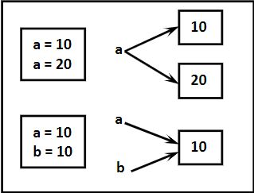
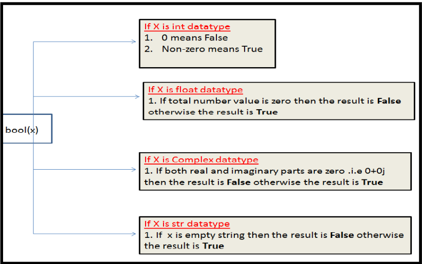

## **Introduction to Python**  
- Python is a general-purpose, high-level programming language.  
- Developed by Guido Van Rossum in 1989 at the National Research Institute, Netherlands.  
- Officially released on February 20, 1991.  
- Recommended as the first programming language for beginners.  
- Simplified syntax examples:  
  - **Java**: Requires multiple lines for simple tasks.  
  - **C**: Includes boilerplate code.  
  - **Python**: Simple one-liners like `print("Hello World")`.  
- Named after the TV show *Monty Python's Flying Circus*.  
- Combines features from multiple languages like C, C++, Perl, and Modula-3.  

### **Applications of Python**  
1. Desktop Applications  
2. Web Applications  
3. Database Applications  
4. Network Programming  
5. Game Development  
6. Data Analysis  
7. Machine Learning  
8. Artificial Intelligence  
9. IoT Applications  

### **Features of Python**  
1. **Simple and Easy to Learn**: Readable syntax with fewer keywords.  
2. **Freeware and Open Source**: No license required; customizable (e.g., Jython).  
3. **High-Level Language**: Focuses on programming logic, not low-level details.  
4. **Platform Independent**: Runs on multiple platforms without modification.  
5. **Portable**: Consistent results across platforms.  
6. **Dynamically Typed**: Variable types assigned automatically at runtime.  
7. **Supports Multiple Paradigms**: Procedural and Object-Oriented features.  
8. **Interpreted**: No explicit compilation; errors caught during runtime.  
9. **Extensible**: Allows integration with other languages for performance or legacy code reuse.  
10. **Embeddable**: Can embed Python code in other programs.  
11. **Extensive Library**: Rich standard library for direct use.  

### **Limitations of Python**  
1. Slower performance due to being an interpreted language.  
2. Limited use in mobile application development.  

### **Flavors of Python**  
1. **CPython**: Standard implementation for C applications.  
2. **Jython/JPython**: For Java applications (runs on JVM).  
3. **IronPython**: For .NET applications.  
4. **PyPy**: Offers improved performance via JIT compilation.  
5. **RubyPython**: For Ruby platform integration.  
6. **AnacondaPython**: Designed for large-scale data processing.  

### **Python Versions**  
- Python 1.0: Released in January 1994.  
- Python 2.0: Released in October 2000.  
- Python 3.0: Released in December 2008 (not backward-compatible with Python 2).

---
## **Identifiers**
- A name in a Python program, used as a class, function, module, or variable name (e.g., `a = 10`).
- **Rules for Defining Identifiers:**
1. **Allowed characters:**  
    - Alphabets (lowercase or uppercase), digits (0-9), and underscore (`_`).  
    - Using symbols like `$` causes a syntax error.  
    - Examples:  
    - Valid: `cash = 10`  
    - Invalid: `ca$h = 20`  
2. **Must not start with a digit:**  
    - Examples:  
    - Invalid: `123total`  
    - Valid: `total123`  
3. **Case-sensitive:**  
    - Examples:  
    - `total = 10`, `TOTAL = 999`.  
    - `print(total)` outputs `10`.  
    - `print(TOTAL)` outputs `999`.  
4. **Identifiers starting with `_`:**  
    - Single `_`: Indicates private identifiers.  
    - Double `__`: Strongly private identifiers.  
    - Double underscores at both ends: Language-defined special names (e.g., `__add__`).

- **Additional Rules:**
  - Reserved words cannot be used as identifiers (e.g., `def = 10` is invalid).  
  - No length limit for identifiers, but overly lengthy names are discouraged.  
  - The `$` symbol is not allowed.  

- **Examples of Valid and Invalid Identifiers:**  
  1. `123total` → ❌  
  2. `total123` → ✅  
  3. `java2share` → ✅  
  4. `ca$h` → ❌  
  5. `_abc_abc_` → ✅  
  6. `def` → ❌ (reserved word)  
  7. `if` → ❌ (reserved word)  

- **Special Notes:**  
  1. Identifiers starting with `_` → Private.  
  2. Starting with `__` → Strongly private.  
  3. Starting and ending with `__` → Magic methods or special names.

---
### **Reserved Words**

- Reserved words are predefined keywords in Python that represent specific meanings or functionalities and **cannot** be used as identifiers (variable names, function names, etc.). 

- **List of Reserved Words in Python (33 total):**
  - `True`, `False`, `None` 
  - `and`, `or`, `not`, `is` 
  - `if`, `elif`, `else` 
  - `while`, `for`, `break`, `continue`, `return`, `in`, `yield` 
  - `try`, `except`, `finally`, `raise`, `assert` 
  - `import`, `from`, `as`, `class`, `def`, `pass`, `global`, `nonlocal`, `lambda`, `del`, `with` 

- **Notes:**
  1. All reserved words consist only of **alphabet symbols**. 
  2. **Exceptions:** `True`, `False`, and `None` are capitalized, while the rest are lowercase.  
     - Example:  
       - Invalid: `a = true` 
       - Valid: `a = True` 
  
- **Python Reserved Words**
  ```python
  >>> import keyword
  >>> keyword.kwlist
  ['False', 'None', 'True', 'and', 'as', 'assert', 'break', 'class', 'continue', 'def', 'del', 'elif', 'else', 'except', 'finally', 'for', 'from', 'global', 'if', 'import', 'in', 'is', 'lambda', 'nonlocal', 'not', 'or', 'pass', 'raise', 'return', 'try', 'while', 'with', 'yield']
  ```
---
## **Data Types**

- A **data type** defines the type of data stored in a variable. In Python, data types are assigned automatically based on the value, making Python a **dynamically typed language**.

- **Inbuilt Data Types in Python:**
  1. `int` (Integer)
  2. `float` (Floating-point number)
  3. `complex` (Complex numbers)
  4. `bool` (Boolean)
  5. `str` (String)
  6. `bytes` (Immutable bytes sequence)
  7. `bytearray` (Mutable bytes sequence)
  8. `range` (Range of numbers)
  9. `list` (Ordered collection)
  10. `tuple` (Immutable ordered collection)
  11. `set` (Unordered unique collection)
  12. `frozenset` (Immutable set)
  13. `dict` (Key-value pairs)
  14. `None` (No value)
  
  

- **Functions to Check Data Types:**
  1. `type()` – To check the type of a variable.
  2. `id()` – To get the memory address of an object.
  3. `print()` – To print the value of a variable.


### **1. `int` Data Type:**
- Used to represent **whole numbers** (integral values).
- Example:  
```python
a = 10
print(type(a))  # Output: <class 'int'>
```
- **Representing Int Values:**
1. **Decimal form** (Base-10):  
    - Allowed digits: 0 to 9  
    - Example: `a = 10`
2. **Binary form** (Base-2):  
    - Allowed digits: 0 & 1  
    - Prefix: `0b` or `0B`  
    - Example: `a = 0b1111`
3. **Octal form** (Base-8):  
    - Allowed digits: 0 to 7  
    - Prefix: `0o` or `0O`  
    - Example: `a = 0o123`
4. **Hexadecimal form** (Base-16):  
    - Allowed digits: 0 to 9, a-f (lowercase or uppercase)  
    - Prefix: `0x` or `0X`  
    - Example: `a = 0xFACE`
  
- **Example:**  
```python
a = 10       # Decimal
b = 0o10      # Octal
c = 0x10      # Hexadecimal
d = 0b10      # Binary
 print(a)      # Output: 10 (Decimal)
 print(b)      # Output: 8 (Octal)
 print(c)      # Output: 16 (Hexadecimal)
 print(d)      # Output: 2 (Binary)
 ```

### **Base Conversions in Python**

Python provides built-in functions to convert numbers between different bases:

1. **`bin()`**: Converts an integer to binary (base-2).
```python
bin(15)        # Output: '0b1111'
bin(0o11)      # Output: '0b1001' 
bin(0x10)      # Output: '0b10000'
```

1. **`oct()`**: Converts an integer to octal (base-8).
```python
oct(10)        # Output: '0o12'
oct(0b1111)    # Output: '0o17'
oct(0x123)     # Output: '0o443'
```

1. **`hex()`**: Converts an integer to hexadecimal (base-16).
```python
hex(100)       # Output: '0x64'
hex(0b111111)  # Output: '0x3f'
hex(0o12345)   # Output: '0x14e5'
```

## **Float Data Type**

- The **`float`** data type represents **floating-point numbers** (decimal values).
    ```python
    f = 1.234
    print(type(f))  # Output: <class 'float'>
    ```

- **Exponential (Scientific Notation)**: You can also represent floating-point numbers in scientific notation, which is useful for large or small numbers.
    ```python
    exponential_value = 1.2e3  # Exponential notation (1.2 * 10^3)
    print(exponential_value)  # Output: 1200.0
    ```

- Note: You can use both lowercase `e` or uppercase `E` for exponential notation.

### **Restrictions with Floats:**
- **Floats can only be represented in decimal form**. Attempting to represent floats in binary, octal, or hexadecimal formats will result in syntax errors:
    ```python
    f = 0B11.01    # SyntaxError: invalid syntax
    f = 0o123.456  # SyntaxError: invalid syntax
    f = 0X123.456  # SyntaxError: invalid syntax
    ```

### 1. **Decimal (Base 10)**

By default, Python uses **decimal** numbers (Base 10), which are the standard numbers we use every day. These numbers can include digits from `0` to `9`.

  ```python
    decimal_value = 123  # Decimal (Base 10)
    print(decimal_value)  # Output: 123
  ```

- **No prefix is needed** for decimal numbers. Simply write the number.


### 2. **Binary (Base 2)** - Using `0B` or `0b`

Python allows you to represent numbers in **binary** (Base 2), which is a number system that only uses the digits `0` and `1`. This is useful, for example, when working with computers at a low level, as computers use binary.

- The **prefix `0B`** or **`0b`** is used to indicate a **binary** number.

    ```python
    binary_value = 0B1010  # Binary (Base 2)
    print(binary_value)  # Output: 10
    ```

- `0B1010` means: 
    - `1 * 2^3 + 0 * 2^2 + 1 * 2^1 + 0 * 2^0 = 8 + 0 + 2 + 0 = 10` in decimal.


### 3. **Octal (Base 8)** - Using `0O` or `0o`

Python also supports **octal** numbers, which are based on **Base 8**. Octal uses digits from `0` to `7`. The prefix `0O` or `0o` is used to denote octal numbers.

- **Prefix `0O`** or **`0o`** indicates an **octal** number.

    ```python
    octal_value = 0o17  # Octal (Base 8)
    print(octal_value)  # Output: 15
    ```

- `0o17` in octal means:
    - `1 * 8^1 + 7 * 8^0 = 8 + 7 = 15` in decimal.


### 4. **Hexadecimal (Base 16)** - Using `0X` or `0x`

**Hexadecimal** is a number system based on **Base 16**, using digits from `0` to `9` and letters `a` to `f` (or `A` to `F`). The prefix `0X` or `0x` is used for hexadecimal numbers.

- **Prefix `0X`** or **`0x`** indicates a **hexadecimal** number.

    ```python
    hexadecimal_value = 0x1A  # Hexadecimal (Base 16)
    print(hexadecimal_value)  # Output: 26
    ```

- `0x1A` in hexadecimal means:
    - `1 * 16^1 + 10 * 16^0 = 16 + 10 = 26` in decimal.


### 5. **Exponential Form (Scientific Notation)**

When working with very large or very small numbers, Python provides the ability to represent numbers in **exponential** form (also called scientific notation).

- **Exponent notation** uses `e` or `E` to represent powers of 10.

    ```python
    exponential_value = 1.2e3  # Exponential notation (1.2 * 10^3)
    print(exponential_value)  # Output: 1200.0
    ```

- `1.2e3` means `1.2 * 10^3`, which is `1200.0` in decimal.


### **Summary of Number Prefixes:**
| Number System | Prefix in Python | Example | Base | Explanation |
|--------------|------------------|---------|------|-------------|
| Decimal | None | `123` | Base 10 | Standard number system (0 to 9) |
| Binary | `0B` or `0b` | `0b1010` | Base 2 | Binary system (0 and 1) |
| Octal | `0O` or `0o` | `0o17` | Base 8 | Octal system (0 to 7) |
| Hexadecimal | `0X` or `0x` | `0x1A` | Base 16 | Hexadecimal system (0-9, a-f) |
| Exponential | `e` or `E` | `1.2e3` | Power of 10 | Scientific notation (large or small values) |


---
## **Complex Data Type**

A **complex number** in Python is a number that has two parts:
- A **real part** (which can be an integer or a floating-point number).
- An **imaginary part** (which must always be a decimal number).

In Python, complex numbers are represented in the form of `a + bj`, where:
- `a` is the real part.
- `b` is the imaginary part (with `j` or `J` used as the imaginary unit).


```python
a = 3 + 5j  # Real part is 3, imaginary part is 5
b = 10 + 5.5j  # Real part is 10, imaginary part is 5.5
c = 0.5 + 0.1j  # Real part is 0.5, imaginary part is 0.1
```

- The real part (`a` in `a + bj`) can be written using **decimal**, **octal**, **binary**, or **hexadecimal** values. However, the **imaginary part** (`b` in `a + bj`) must always be represented as a **decimal** value.


```python
a = 0B11 + 5j  # Valid, 0B11 is binary for 3, imaginary part is 5
print(a)  # Output: (3+5j)

# Invalid example:
a = 3 + 0B11j  # SyntaxError: invalid syntax, because the imaginary part cannot be in binary
```

### Operations on Complex Numbers

You can perform arithmetic operations on complex numbers, such as addition, subtraction, multiplication, and division.

```python
a = 10 + 1.5j
b = 20 + 2.5j
c = a + b  # Adding complex numbers
print(c)  # Output: (30+4j)
```

### Getting Real and Imaginary Parts

Python provides built-in attributes `.real` and `.imag` to extract the real and imaginary parts of a complex number.


```python
c = 10.5 + 3.6j
print(c.real)  # Output: 10.5 (real part)
print(c.imag)  # Output: 3.6 (imaginary part)
```

- Complex numbers are often used in scientific computing and applications like **signal processing**, **electrical engineering**, and **quantum mechanics**.


---
## **Boolean Data Type**

In Python, the **bool** data type is used to represent **Boolean values**, which can only be:
- `True`
- `False`

Internally, Python represents `True` as `1` and `False` as `0`.


```python
b = True
print(type(b))  # Output: <class 'bool'>, indicating that the variable is of type bool
```

Boolean values are often used in conditional statements and logical operations.

s of operations with booleans:
```python
a = 10
b = 20
c = a < b  # Compares a and b, returns True since 10 is less than 20
print(c)  # Output: True

# Boolean arithmetic
print(True + True)  # Output: 2 (because True is treated as 1)
print(True - False)  # Output: 1 (True as 1, False as 0)
```
---
## **String Data Type (`str`)**

In Python, the `str` data type is used to represent strings, which are sequences of characters. These characters can include letters, numbers, symbols, spaces, etc. Strings are enclosed in **single quotes (' ')** or **double quotes (" ")**.


```python
s1 = 'durga'
s2 = "durga"
```
Both of these are valid string assignments. There's no difference in behavior between single and double quotes. However, you might choose one over the other to avoid conflicts when using quotes inside the string.

### Multi-line Strings

Strings enclosed by **single** or **double quotes** cannot span multiple lines. For multi-line strings, Python provides **triple quotes** (either single `'''` or double `"""`).


```python
s1 = '''durga soft'''
s2 = """durga soft"""
```
You can use triple quotes to define a string that spans multiple lines, making it easier to handle longer text blocks.

 with embedded quotes:
You can also use triple quotes to include **single quotes** or **double quotes** in the string without escaping them.

```python
s3 = '''This is "character"'''
s4 = """This is 'character'"""
```

### **Slicing of Strings**

**String slicing** allows you to extract parts of a string. Python uses the **slice operator** (`[ ]`) for this purpose, and the string follows a **zero-based index**.

### **Indexing:**
- Positive indices count from left to right (starting at `0`).
- Negative indices count from right to left (starting at `-1`).


```python
s = "durga"
print(s[0])  # 'd'  (First character)
print(s[1])  # 'u'  (Second character)
print(s[-1])  # 'a' (Last character)
```

If you try to access an index that's out of range, Python will raise an `IndexError`.

```python
print(s[40])  # IndexError: string index out of range
```

#### Slicing Syntax: `[start:end]`
- **Start** is the index where slicing begins (inclusive).
- **End** is the index where slicing ends (exclusive).

If you omit **start** or **end**, Python will assume defaults:
- If you omit **start**, it will default to `0` (beginning of the string).
- If you omit **end**, it will default to the string's length (the entire string).


```python
print(s[1:40])  # 'urga' (Index from 1 to end of string)
print(s[1:])    # 'urga' (From index 1 to the end)
print(s[:4])    # 'durg' (From start to index 3)
print(s[:])     # 'durga' (Whole string)
```

#### String Operations:
- **Repeating a string** using `*`:
```python
print(s * 3)  # 'durgadurgadurga'
```

- **Getting the length of a string** using `len()`:
```python
print(len(s))  # 5 (The string "durga" has 5 characters)
```

### String as Character Type

In Python, **characters** are also treated as **strings**. There is no separate **char** data type. A single character is just a string of length 1.


```python
c = 'a'
print(type(c))  # <class 'str'> (Character is treated as a string)
```
---

## **TYPE CASTING**

Type casting refers to converting one data type into another. This conversion is called **Typecasting** or **Type coercion**. You can use various inbuilt functions for type casting. ✨

### **Functions for Type Casting:**
1. `int()`  
2. `float()`  
3. `complex()`  
4. `bool()`  
5. `str()`  


### **`int()`**  
We can use the `int()` function to convert other types of values to integers. Examples:

- `int(123.987)` → `123`  
- `int(True)` → `1`  
- `int(False)` → `0`  
- `int("10")` → `10`  
- `int("10.5")` → **ValueError: invalid literal for int()**

**Note:**  
- You can convert from any type to `int` except `complex`.  
- When converting a string (`str`) to `int`, the string must contain only an integer value and should be specified in base-10. 


### **`float()`**  
The `float()` function is used to convert other types of values to float. Examples:

- `float(10)` → `10.0`  
- `float(True)` → `1.0`  
- `float(False)` → `0.0`  
- `float("10")` → `10.0`  
- `float("10.5")` → `10.5`  
- `float("ten")` → **ValueError: could not convert string to float: 'ten'**

**Note:**  
- You can convert any type to `float` except `complex`.  
- When converting a string (`str`) to `float`, it should be either an integral or floating-point literal and must be in base-10. 


### **`complex()`**  
We can use the `complex()` function to convert other types into complex numbers. 

**Form-1:** `complex(x)`  
This converts `x` into a complex number with a real part `x` and an imaginary part of `0`. Examples:

- `complex(10)` → `10+0j`  
- `complex(10.5)` → `10.5+0j`  
- `complex(True)` → `1+0j`

**Form-2:** `complex(x, y)`  
This converts `x` and `y` into a complex number, with `x` as the real part and `y` as the imaginary part.

- `complex(10, -2)` → `10-2j`  
- `complex(True, False)` → `1+0j`

**Note:**  
- Strings like `"ten"` cannot be converted directly to complex numbers and will raise an error. ❌


### **`bool()`**  
The `bool()` function converts other types into boolean values (`True` or `False`). Examples:

- `bool(0)` → `False`  
- `bool(1)` → `True`  
- `bool(10)` → `True`  
- `bool(10.5)` → `True`  
- `bool("")` → `False`  
- `bool("True")` → `True`  

**Note:**  
- `bool()` treats any non-zero value as `True` and `0` or an empty value (like an empty string) as `False`. ⚖️




### **`str()`**  
The `str()` function is used to convert other types of values into strings. Here are some examples:

- `str(10)` → `'10'`  
- `str(10.5)` → `'10.5'`  
- `str(10+5j)` → `'(10+5j)'`  
- `str(True)` → `'True'`  
 
The `str()` function provides a string representation of the given object. It works for all basic data types, and even for more complex objects like complex numbers. 

---
## **Fundamental Data Types vs Immutability**

### 1. **What is Immutability?**
- Fundamental data types in Python, like `int`, `float`, `str`, `bool`, and `complex`, are **immutable**.
- This means once you create an object of these types, you can’t change its value. Any change makes a new object instead.

### 2. **How Python Saves Memory**
- Python reuses some objects with the same value to save memory and make things faster.
- This works for small numbers (like -5 to 256), `True` and `False`, and some short strings. But it doesn’t always happen for big numbers, floats, or complex numbers.

### 3. **Why Use Immutability?**
- Immutability stops problems when multiple variables point to the same object.
- If you could change the object, all variables would see the change, which might mess up your program.
- Since immutable objects can’t change, this problem doesn’t happen, keeping your code safe.

### 4. **Examples to Show How It Works**
- **Small Numbers**: Python reuses small numbers. For example, `a = 10` and `b = 10` use the same object, but big numbers like `1000` might not.
  ```python
  a = 10
  b = 10
  print(a is b)  # Output: True (same object)

  x = 1000
  y = 1000
  print(x is y)  # Output: False (different objects)
  ```
- **Complex Numbers**: These can’t change, but Python makes a new object every time, even if the values are the same.
  ```python
  a = 10 + 5j
  b = 10 + 5j
  print(a is b)  # Output: False (different objects)
  ```
- **True and False**: Python only has one `True` and one `False`, so they’re always the same object.
  ```python
  a = True
  b = True
  print(a is b)  # Output: True (same object)
  ```
- **Strings**: Strings can’t change, and short ones often reuse the same object. But if you build a string in parts, it might not.
  ```python
  a = "hello"
  b = "hello"
  print(a is b)  # Output: True (same object)

  c = "hello" + "world"
  d = "helloworld"
  print(c is d)  # Output: False (different objects)
  ```

### 7. **bytearray Data Type**:
- `bytearray` is similar to the `bytes` data type, but its elements can be modified.
- Example:
  ```python
  x = [10, 20, 30, 40]
  b = bytearray(x)
  b[0] = 100
  ```
- If you try to create a `bytearray` with a value outside the range of 0-255, you'll get a `ValueError`.

### 8. **List Data Type**:
- Lists are ordered, mutable, and heterogeneous collections of elements.
- Key features:
  1. Insertion order is preserved.
  2. Heterogeneous objects are allowed.
  3. Duplicates are allowed.
  4. Lists are growable in nature.
  5. Values are enclosed within square brackets.
- Example:
  ```python
  list = [10, 10.5, 'durga', True, 10]
  ```

### 9. **Tuple Data Type**:
- Tuples are similar to lists, but they are immutable, meaning their elements cannot be modified.
- Tuple elements are enclosed within parentheses.
- Example:
  ```python
  t = (10, 20, 30, 40)
  ```
- Tuples are the read-only version of lists.

### 1. **Range Data Type**:
- The `range` data type represents a sequence of numbers and is immutable.
- Three forms:
  1. `range(10)`: Generates numbers from 0 to 9.
  2. `range(10, 20)`: Generates numbers from 10 to 19.
  3. `range(10, 20, 2)`: Generates numbers from 10 to 18 with a step of 2.
- Example:
  ```python
  r = range(10, 20)
  ```

### 2. **Set Data Type**:
- Represents a group of values without duplicates and without order.
- Key features:
  1. Insertion order is not preserved.
  2. Duplicates are not allowed.
  3. Heterogeneous objects are allowed.
  4. Index concept is not applicable.
  5. Sets are mutable collections.
  6. Sets are growable in nature.
- Example:
  ```python
  s = {100, 0, 10, 200, 10, 'durga'}
  ```

### 3. **Frozenset Data Type**:
- `frozenset` is the same as `set`, but it is immutable.
- Example:
  ```python
  s = {10, 20, 30, 40}
  fs = frozenset(s)
  ```

### 13. **Dict Data Type**:
- Represents a group of values as key-value pairs.
- Key points:
  1. Duplicate keys are not allowed, but duplicate values are allowed.
  2. If a duplicate key is added, the old value is replaced.
  3. Dictionaries are mutable.
- Example:
  ```python
  d = {101: 'durga', 102: 'ravi', 103: 'shiva'}
  ```

### 14. **None Data Type**:
- Represents nothing or no value.
- Used when a value is not available.
- Example:
  ```python
  def m1():    
      a = 10  
  ```

---

| **Datatype**   | **Description**                                        | **Is Immutable?** | **Example**                                                                                       |
|----------------|-------------------------------------------------------|------------------|--------------------------------------------------------------------------------------------------|
| **Int**        | Used to represent whole/integral numbers               | Immutable         | `>>> a=10` <br> `>>> type(a)` <br> `<class 'int'>`                                               |
| **Float**      | Used to represent decimal/floating point numbers       | Immutable         | `>>> b=10.5` <br> `>>> type(b)` <br> `<class 'float'>`                                           |
| **Complex**    | Used to represent complex numbers                      | Immutable         | `>>> c=10+5j` <br> `>>> type(c)` <br> `<class 'complex'>` <br> `>>> c.real` <br> `10.0` <br> `>>> c.imag` <br> `5.0` |
| **Bool**       | Used to represent logical values (True or False)       | Immutable         | `>>> flag=True` <br> `>>> flag=False` <br> `>>> type(flag)` <br> `<class 'bool'>`               |
| **Str**        | Used to represent sequence of characters               | Immutable         | `>>> s='durga'` <br> `>>> type(s)` <br> `<class 'str'>` <br> `>>> s="durga"` <br> `>>> s='''Durga Software Solutions... Ameerpet'''` |
| **Bytes**      | Used to represent a sequence of byte values (0-255)    | Immutable         | `>>> list=[1,2,3,4]` <br> `>>> b=bytes(list)` <br> `>>> type(b)` <br> `<class 'bytes'>`        |
| **Bytearray**  | Used to represent a sequence of byte values (0-255)    | Mutable           | `>>> list=[10,20,30]` <br> `>>> ba=bytearray(list)` <br> `>>> type(ba)` <br> `<class 'bytearray'>`|
| **Range**      | Used to represent a range of values                    | Immutable         | `>>> r=range(10)` <br> `>>> r1=range(0,10)` <br> `>>> r2=range(0,10,2)`                         |
| **List**       | Used to represent an ordered collection of objects     | Mutable           | `>>> l=[10,11,12,13,14,15]` <br> `>>> type(l)` <br> `<class 'list'>`                            |
| **Tuple**      | Used to represent ordered collections of objects       | Immutable         | `>>> t=(1,2,3,4,5)` <br> `>>> type(t)` <br> `<class 'tuple'>`                                   |
| **Set**        | Used to represent an unordered collection of unique objects | Mutable      | `>>> s={1,2,3,4,5,6}` <br> `>>> type(s)` <br> `<class 'set'>`                                   |
| **Frozenset**  | Used to represent an unordered collection of unique objects | Immutable    | `>>> s={11,2,3,'Durga',100,'Ramu'}` <br> `>>> fs=frozenset(s)` <br> `>>> type(fs)` <br> `<class 'frozenset'>` |
| **Dict**       | Used to represent a group of key-value pairs           | Mutable           | `>>> d = {101:'durga', 102:'ramu', 103:'hari'}` <br> `>>> type(d)` <br> `<class 'dict'>`       |

---

## **Escape Characters**

### **What Are Escape Characters?**
- In Python strings, **escape characters** are special codes starting with a backslash (`\`) that give extra meaning to the text.
- They let you add things like new lines or tabs, or include special symbols like quotes.

### **Examples of Escape Characters**

1. **New Line (`\n`)**  
   - Adds a new line in the string.  
   ```python
   s = "durga\nsoftware"
   print(s)
   ```  
   - Output:  
     ```
     durga
     software
     ```

2. **Tab (`\t`)**  
   - Adds a horizontal tab (space) in the string.  
   ```python
   s = "durga\tsoftware"
   print(s)
   ```  
   - Output:  
     ```
     durga    software
     ```

3. **Incorrect Quotes (No Escape)**  
   - Without an escape character, quotes can cause an error.  
   ```python
   s = "This is " symbol"  # This is wrong
   ```  
   - Output:  
     ```
     File "<stdin>", line 1
       s = "This is " symbol"
                      ^
     SyntaxError: invalid syntax
     ```

4. **Double Quote (`\"`)**  
   - Use `\"` to include a double quote inside a string.  
   ```python
   s = "This is \" symbol"
   print(s)
   ```  
   - Output:  
     ```
     This is " symbol
     ```
---


### **Escape Characters in Python**
| **Escape Character** | **Description**              |
|---------------------|------------------------------|
| `\n`                | New Line                     |
| `\t`                | Horizontal Tab (space)       |
| `\r`                | Carriage Return              |
| `\b`                | Back Space                   |
| `\f`                | Form Feed                    |
| `\v`                | Vertical Tab                 |
| `\'`                | Single Quote (')             |
| `\"`                | Double Quote (")             |
| `\\`                | Back Slash (\)               |


### **Constants in Python:**
- Python does not have a concept of constants as in other languages.
- However, it is a convention to use uppercase characters for variables that should not be changed.

**Example**:
```python
MAX_VALUE = 10  # Conventionally treated as a constant
```
- This is just a convention; the value of `MAX_VALUE` can still be changed in Python, but it is typically not recommended.

---


## **Python Input and Output Notes**

### 1. Reading Dynamic Input from the Keyboard

- The `input()` function in Python 3 reads keyboard input.
- It always returns data as a string, regardless of the input type.


```python
>>> type(input("Enter value:"))
Enter value: 10
<class 'str'>

Enter value: 10.5
<class 'str'>

Enter value: True
<class 'str'>
```

---

### Methods for Numeric Input

#### Method 1: Using Intermediate Variables
- Collect input as strings, then convert to the desired type.

```python
x = input("Enter First Number:")   
y = input("Enter Second Number:")   
i = int(x)   
j = int(y)   
print("The Sum:", i + j)
```

**Example Output:**
```
Enter First Number: 100  
Enter Second Number: 200  
The Sum: 300
```

#### Method 2: Direct Type Casting
- Convert input to the desired type directly within the `input()` call.

```python
x = int(input("Enter First Number:"))   
y = int(input("Enter Second Number:"))   
print("The Sum:", x + y)
```

**Example Output:**
```
Enter First Number: 100  
Enter Second Number: 200  
The Sum: 300
```

#### Method 3: One-Line Solution
- Combine input and calculation in a single line.

```python
print("The Sum:", int(input("Enter First Number:")) + int(input("Enter Second Number:")))
```

**Example Output:**
```
Enter First Number: 100  
Enter Second Number: 200  
The Sum: 300
```

---

### Example Program: Employee Data
- Collect and display mixed data types from user input.

```python
eno = int(input("Enter Employee No:"))
ename = input("Enter Employee Name:")
esal = float(input("Enter Employee Salary:"))
eaddr = input("Enter Employee Address:")
married = bool(input("Employee Married? [True|False]:"))

print("Please Confirm Information")
print("Employee No:", eno)
print("Employee Name:", ename)
print("Employee Salary:", esal)
print("Employee Address:", eaddr)
print("Employee Married?:", married)
```

**Example Output:**
```
Enter Employee No: 100
Enter Employee Name: Drishya
Enter Employee Salary: 1000
Enter Employee Address: Mumbai
Employee Married? [True|False]: True
Please Confirm Information
Employee No: 100
Employee Name: Drishya
Employee Salary: 1000.0
Employee Address: Mumbai
Employee Married?: True
```

---

### Reading Multiple Values in One Line

#### Using `split()`
- Use `split()` to separate multiple values entered in a single line.

```python
a, b = [int(x) for x in input("Enter 2 numbers: ").split()]   
print("Product is:", a * b)
```

**Example Output:**
```
Enter 2 numbers: 10 20
Product is: 200
```

**Note**: 
- Default separator for `split()` is a space.
- Custom separators (e.g., commas) can be specified.

 Program: Sum of Three Float Numbers
- Read three float values with a comma separator.

```python
a, b, c = [float(x) for x in input("Enter 3 float numbers: ").split(',')]   
print("The Sum is:", a + b + c)
```

**Example Output:**
```
Enter 3 float numbers: 10.5,20.6,20.1
The Sum is: 51.2
```

---

### Using `eval()`
- The `eval()` function evaluates a string as Python code.

 1: Simple Expression
```python
x = eval("10 + 20 + 30")  
print(x)
```
**Output**: `60`

 2: User-Provided Expression
```python
x = eval(input("Enter Expression: "))  
# Input: 10 + 2 * 3 / 4
print(x)
```
**Output**: `11.5`

 3: Evaluating Collections
```python
l = eval(input("Enter List: "))  
print("Type of l:", type(l))  
print("Contents of l:", l)
```

**Example Output:**
```
Enter List: [1, 2, 3]
Type of l: <class 'list'>
Contents of l: [1, 2, 3]
```

---

## 2. Command Line Arguments in Python

### Overview
- Command line arguments are values passed when running a Python script.
- Accessed via `argv` from the `sys` module, which is a list.
- `argv[0]` is the script name; `argv[1:]` are the arguments.

: Checking `argv` Type
```python
from sys import argv
print(type(argv))
```

**Example Execution:**
```
D:\Python_classes>py test.py
<class 'list'>
```

---

### Accessing Arguments
```python
from sys import argv
print("Script Name:", argv[0])
print("Command Line Arguments:", argv[1:])
```

**Example Execution:**
```
D:\Python_classes>py test.py 10 20 30
Script Name: test.py
Command Line Arguments: ['10', '20', '30']
```

---

### Example Program: Displaying All Arguments
```python
from sys import argv
print("The Number of Command Line Arguments:", len(argv))
print("The List of Command Line Arguments:", argv)
print("Command Line Arguments one by one:")
for x in argv:
    print(x)
```

**Example Execution:**
```
PS D:\Durga's Python> py Session01.py 10 20 30 40 05 60 70 80
The Number of Command Line Arguments: 9
The List of Command Line Arguments: ['Session01.py', '10', '20', '30', '40', '05', '60', '70', '80']
Command Line Arguments one by one:
Session01.py
10
20
30
40
05
60
70
80
```

---

### Additional Notes

#### Note 1: Handling Spaces
- Spaces are the default separator.
- Use double quotes to include spaces in a single argument.

```python
from sys import argv
print(argv[1])
```

**Example Execution:**
```
D:\Python_classes>py test.py "Drishya thakur"
Drishya thakur
```

#### Note 2: Arguments Are Strings
- All `argv` elements are strings; typecasting is required for other types.

```python
from sys import argv
print(argv[1] + argv[2])          # String concatenation
print(int(argv[1]) + int(argv[2]))  # Integer addition
```

**Example Execution:**
```
D:\Python_classes>py test.py 10 20
1020
30
```

#### Note 3: Index Errors
- Accessing an invalid index raises an `IndexError`.

```python
from sys import argv
print(argv[100])
```

**Example Execution:**
```
D:\Python_classes>py test.py 10 20
IndexError: list index out of range
```

#### Note 4: Using `argparse`
- The `argparse` module provides advanced argument handling:
  - Default values
  - Help messages
  - Type validation

---

## 3. Output Statements in Python

### Overview
- The `print()` function displays output in various formats.

#### Form 1: Empty `print()`
- Outputs a newline character.

#### Form 2: Printing Strings
- Supports escape characters and operators.

```python
print("Hello World")
print("Hello\nWorld")      # Newline
print("Hello\tWorld")      # Tab
print(10 * "Hello")        # Repetition
print("Hello" + "World")   # Concatenation
```

**Note**: 
- `+` concatenates strings but fails if types mismatch (e.g., string + integer).

---

#### Form 3: Multiple Arguments
- Prints multiple values, separated by spaces by default.

```python
a, b, c = 10, 20, 30
print("The Values are:", a, b, c)  # The Values are: 10 20 30
print(a, b, c, sep=',')          # 10,20,30
```

---

#### Form 4: Custom `end` Attribute
- Default `end` is `\n`; customize to change line behavior.

```python
print("Hello", end=' ')
print("Durga", end=' ')
print("Soft")  # Hello Durga Soft
```

---

#### Form 5: Printing Objects
- Displays collections like lists or tuples.

```python
l = [10, 20, 30, 40]
print(l)  # [10, 20, 30, 40]
```

---

#### Form 6: Strings and Variables
- Combines text and variables for readable output.

```python
s = "Durga"
a = 48
print("Hello", s, "Your Age is", a)  # Hello Durga Your Age is 48
```

---

#### Form 7: Formatted Strings with `%`
- Uses placeholders: `%i`/`%d` (integer), `%f` (float), `%s` (string).

```python
a, b = 10, 20
print("a value is %i" % a)          # a value is 10
print("b value is %d" % b)          # b value is 20
```

---

#### Form 8: Using `format()` Method
- Replaces `{}` placeholders with values.

```python
name = "Durga"
salary = 10000
print("Hello {} your salary is {}".format(name, salary))
# Hello Durga your salary is 10000
```

---
## **Form 9: F-Strings (Formatted String Literals)**

- F-strings provide a concise and readable way to embed expressions inside string literals.
- Introduced in Python 3.6, they use the `f` prefix before the string and curly braces `{}` to include variables or expressions directly.

#### Syntax
- Format: `f"text {variable/expression}"`
- Variables and expressions are evaluated at runtime and inserted into the string.

#### Example 1: Basic Usage
```python
name = "Durga"
age = 48
print(f"Hello {name}, your age is {age}")
```

**Output:**
```
Hello Durga, your age is 48
```

#### Example 2: With Expressions
- Perform calculations or call methods inside the f-string.

```python
a = 10
b = 20
print(f"The sum of {a} and {b} is {a + b}")
```

**Output:**
```
The sum of 10 and 20 is 30
```

#### Example 3: Formatting Numbers
- Use format specifiers inside `{}` for precision or alignment.

```python
salary = 12345.6789
print(f"Your salary is ${salary:.2f}")
```

**Output:**
```
Your salary is $12345.68
```

#### Example 4: Multiple Variables
- Combine multiple values seamlessly.

```python
name = "Drishya"
role = "developer"
years = 3
print(f"{name} has been a {role} for {years} years")
```

**Output:**
```
Drishya has been a developer for 3 years
```

#### Example 5: Using Objects
- Access object attributes or elements directly.

```python
person = {"name": "Ravi", "age": 25}
print(f"{person['name']} is {person['age']} years old")
```

**Output:**
```
Ravi is 25 years old
```

---

### Additional Notes
- **Advantages**: 
  - Cleaner and more intuitive than `%` formatting or `.format()`.
  - No need for separate `.format()` calls or tuple unpacking.
- **Limitations**: 
  - Only available in Python 3.6 and later.
  - Expressions inside `{}` must be valid Python code.

#### Example with Error Handling
```python
try:
    num = 42
    print(f"The number is {num} and its square is {num ** 2}")
except Exception as e:
    print(f"Error: {e}")
```

**Output:**
```
The number is 42 and its square is 1764
```

---
