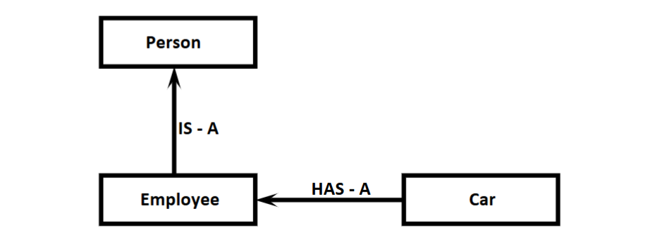

### **Agenda**

* **Inheritance**
* **Has-A Relationship**
* **IS-A Relationship**
* **IS-A vs HAS-A Relationship**
* **Composition vs Aggregation**
* **Types of Inheritance**:

  * **Single Inheritance**
  * **Multi Level Inheritance**
  * **Hierarchical Inheritance**
  * **Multiple Inheritance**
  * **Hybrid Inheritance**
  * **Cyclic Inheritance**
* **Method Resolution Order (MRO)**
* **super() Method**

---

### **Using Members of One Class Inside Another Class**

We can use members of one class inside another class in two ways:

1. **By Composition (Has-A Relationship)**
2. **By Inheritance (IS-A Relationship)**

---

### **1. By Composition (Has-A Relationship)**

* By using class name or creating an object, we can access members of one class inside another class.
* This concept is known as **Composition** or **Has-A Relationship**.
* **Advantage**: Code Reusability.

---

### **Demo Program 1: Engine-Car Example**

```python
class Engine:
    a = 10
    def __init__(self):
        self.b = 20
    def m1(self):
        print('Engine Specific Functionality')

class Car:
    def __init__(self):
        self.engine = Engine()
    def m2(self):
        print('Car using Engine Class Functionality')
        print(self.engine.a)
        print(self.engine.b)
        self.engine.m1()

c = Car()
c.m2()
```

**Output:**

```
Car using Engine Class Functionality  
10  
20  
Engine Specific Functionality  
```

---

### **Demo Program 2: Car-Employee Example**

```python
class Car:
    def __init__(self, name, model, color):
        self.name = name
        self.model = model
        self.color = color
    def getinfo(self):
        print("Car Name:{} , Model:{} and Color:{}".format(self.name, self.model, self.color))

class Employee:
    def __init__(self, ename, eno, car):
        self.ename = ename
        self.eno = eno
        self.car = car
    def empinfo(self):
        print("Employee Name:", self.ename)
        print("Employee Number:", self.eno)
        print("Employee Car Info:")
        self.car.getinfo()

c = Car("Innova", "2.5V", "Grey")
e = Employee('Durga', 10000, c)
e.empinfo()
```

**Output:**

```
Employee Name: Durga  
Employee Number: 10000  
Employee Car Info:  
Car Name: Innova, Model: 2.5V and Color: Grey  
```

**Explanation**:
In this program, `Employee` class **Has-A** `Car` reference and hence it can access all members of the `Car` class.

---

### **Demo Program 3: Class X and Y Example**

```python
class X:
    a = 10
    def __init__(self):
        self.b = 20
    def m1(self):
        print("m1 method of X class")

class Y:
    c = 30
    def __init__(self):
        self.d = 40
    def m2(self):
        print("m2 method of Y class")
    def m3(self):
        x1 = X()
        print(x1.a)
        print(x1.b)
        x1.m1()
        print(Y.c)
        print(self.d)
        self.m2()
        print("m3 method of Y class")

y1 = Y()
y1.m3()
```

**Output:**

```
10  
20  
m1 method of X class  
30  
40  
m2 method of Y class  
m3 method of Y class  
```

---

### **2) By Inheritance (IS-A Relationship)**

* Whatever **variables, methods, and constructors** are available in the parent class are by default available to the child class.
* We are **not required to rewrite** them in the child class.
* **Main Advantage**: **Code Reusability** and ability to **extend existing functionality**.

**Syntax**:

```python
class ChildClass(ParentClass):
    # child class body
```

---

### **Basic Inheritance Example**

```python
class P:
    a = 10
    def __init__(self):
        self.b = 10
    def m1(self):
        print('Parent instance method')
    @classmethod
    def m2(cls):
        print('Parent class method')
    @staticmethod
    def m3():
        print('Parent static method')

class C(P):
    pass

c = C()
print(c.a)
print(c.b)
c.m1()
c.m2()
c.m3()
```

**Output**:

```
10  
10  
Parent instance method  
Parent class method  
Parent static method  
```

---

### **Code Reusability Example**

```python
class P:
    # Contains 10 methods

class C(P):
    # Contains 5 methods
```

* In this example, the child class automatically has **15 methods** due to inheritance.
* No need to rewrite the 10 methods from the parent class.

---

### **Calling Parent and Child Methods Together**

```python
class P:
    def m1(self):
        print("Parent class method")

class C(P):
    def m2(self):
        print("Child class method")

c = C()
c.m1()
c.m2()
```

**Output**:

```
Parent class method  
Child class method  
```

* Child class reference `c` can access **both parent and child methods**.

---

### **Accessing Variables with Inheritance**

```python
class P:
    a = 10
    def __init__(self):
        self.b = 20

class C(P):
    c = 30
    def __init__(self):
        super().__init__()  # Line-1
        self.d = 30

c1 = C()
print(c1.a, c1.b, c1.c, c1.d)
```

* If **Line-1 is commented**, `b` will not be available to the child class.

---

### **Demo Program: Person → Employee Inheritance**

```python
class Person:
    def __init__(self, name, age):
        self.name = name
        self.age = age
    def eatndrink(self):
        print('Eat misal and Drink milk')

class Employee(Person):
    def __init__(self, name, age, eno, esal):
        super().__init__(name, age)
        self.eno = eno
        self.esal = esal
    def work(self):
        print("Coding Python is very easy just like ...")
    def empinfo(self):
        print("Employee Name:", self.name)
        print("Employee Age:", self.age)
        print("Employee Number:", self.eno)
        print("Employee Salary:", self.esal)

e = Employee('Durga', 48, 100, 10000)
e.eatndrink()
e.work()
e.empinfo()
```

**Output**:

```
Eat misal and Drink milk
Coding Python is very easy just like ...
Employee Name: Durga
Employee Age: 48
Employee Number: 100
Employee Salary: 10000
```

---

### **IS-A vs HAS-A Relationship**

| **IS-A Relationship**             | **HAS-A Relationship**          |
| --------------------------------- | ------------------------------- |
| Extends functionality             | Uses functionality              |
| Achieved through inheritance      | Achieved through composition    |
| Example: `Employee` IS-A `Person` | Example: `Employee` HAS-A `Car` |


#### IS-A vs HAS-A Relationship:

> If we want to extend existing functionality with some more extra functionality then we
should go for IS-A Relationship.
> If we dont want to extend and just we have to use existing functionality then we
should go for HAS-A Relationship.
> Eg: Employee class extends Person class Functionality But Employee class just uses Car
functionality but not extending

---



### **Example: IS-A + HAS-A Combination**

```python
class Car:
    def __init__(self, name, model, color):
        self.name = name
        self.model = model
        self.color = color
    def getinfo(self):
        print("\tCar Name:{} \n\t Model:{} \n\t Color:{}".format(self.name, self.model, self.color))

class Person:
    def __init__(self, name, age):
        self.name = name
        self.age = age
    def eatndrink(self):
        print('Eat Biryani and Drink Beer')

class Employee(Person):  # IS-A
    def __init__(self, name, age, eno, esal, car):  # HAS-A
        super().__init__(name, age)
        self.eno = eno
        self.esal = esal
        self.car = car
    def work(self):
        print("Coding Python is very easy just like drinking Chilled Beer")
    def empinfo(self):
        print("Employee Name:", self.name)
        print("Employee Age:", self.age)
        print("Employee Number:", self.eno)
        print("Employee Salary:", self.esal)
        print("Employee Car Info:")
        self.car.getinfo()

c = Car("Innova", "2.5V", "Grey")
e = Employee('Durga', 48, 100, 10000, c)
e.eatndrink()
e.work()
e.empinfo()
```

**Output**:

```
Eat Biryani and Drink Beer  
Coding Python is very easy just like drinking Chilled Beer  
Employee Name: Durga  
Employee Age: 48  
Employee Number: 100  
Employee Salary: 10000  
Employee Car Info:  
Car Name: Innova  
Model: 2.5V  
Color: Grey  
```

**Explanation**:

* `Employee` class **extends** `Person` class → **IS-A**
* `Employee` class **uses** `Car` class object → **HAS-A**

---

### **Composition vs Aggregation**

---

### **Composition**

* If **without the container object**, the **contained object cannot exist**, the two are **strongly associated**.
* This **strong association** is called **Composition**.

**Example:**
A **University** contains several **Departments**.
Without a university, there is **no chance** for departments to exist independently.
Hence, this is **Composition**.

```
University Object (Container Object)
   |
   ---> Department Object (Contained Object)
```

---

### **Aggregation**

* If **without the container object**, the **contained object can still exist**, the two are **weakly associated**.
* This **weak association** is called **Aggregation**.

**Example:**
A **Department** contains several **Professors**.
Even if the department is deleted, **professors** can exist independently.
Hence, this is **Aggregation**.

```
Department Object (Container Object)
   |
   ---> Professor Object (Contained Object)
```

---

### **Code Example: Composition & Aggregation**

```python
class Student:
    collegeName = 'DURGASOFT'   # static variable (aggregation)

    def __init__(self, name):
        self.name = name        # instance variable (composition)
        print(Student.collegeName)

s = Student('Durga')
print(s.name)
```

**Output:**

```
DURGASOFT
Durga
```

**Explanation:**

* `self.name` is **strongly associated** with the object `s` → **Composition**.
* `collegeName` is a **static variable**, so it exists independently → **Aggregation**.

---

### **Conclusion**

* Relationship between **object and its instance variables** = **Composition**.
* Relationship between **object and static variables** = **Aggregation**.

---

### **Note on Constructor Execution in Inheritance**

> When a child class object is created:

* If the child has a constructor → **child's constructor is executed**.
* If not → **parent's constructor is executed**.
* **Parent object is not created**, only **child object** is created.

---

### **Code Example: Constructor Execution**

```python
class P:
    def __init__(self):
        print(id(self))

class C(P):
    pass

c = C()
print(id(c))
```

**Output:**

```
6207088
6207088
```

**Explanation:**
Same `id` confirms that **only one object** is created (of class `C`), and parent constructor ran because `C` has no constructor.

---

### **Code Example: Inheritance with Both Constructors**

```python
class Person:
    def __init__(self, name, age):
        self.name = name
        self.age = age

class Student(Person):
    def __init__(self, name, age, rollno, marks):
        super().__init__(name, age)
        self.rollno = rollno
        self.marks = marks

    def __str__(self):
        return 'Name={}\nAge={}\nRollno={}\nMarks={}'.format(
            self.name, self.age, self.rollno, self.marks)

s1 = Student('durga', 48, 101, 90)
print(s1)
```

**Output:**

```
Name=durga
Age=48
Rollno=101
Marks=90
```

**Explanation:**
Both **parent and child constructors** executed to initialize `Student` object.

---


# **Types of Inheritance in Python**

---

### **1) Single Inheritance**

> The concept of inheriting the properties from one class to another class is known as **single inheritance**.

```python
class P:
    def m1(self):
        print("Parent Method")

class C(P):
    def m2(self):
        print("Child Method")

c = C()
c.m1()
c.m2()
```

**Output:**

```
Parent Method
Child Method
```

**Class Hierarchy:**

```
P
└── C
```


### **2) Multilevel Inheritance**

> Inheriting properties from one class to another in a chain-like manner is known as **multilevel inheritance**.

```python
class P:
    def m1(self):
        print("Parent Method")

class C(P):
    def m2(self):
        print("Child Method")

class CC(C):
    def m3(self):
        print("Sub Child Method")

c = CC()
c.m1()
c.m2()
c.m3()
```

**Output:**

```
Parent Method
Child Method
Sub Child Method
```

**Class Hierarchy:**

```
P
└── C
    └── CC
```


### **3) Hierarchical Inheritance**

> Inheriting properties from one parent class into multiple child classes is known as **hierarchical inheritance**.

```python
class P:
    def m1(self):
        print("Parent Method")

class C1(P):
    def m2(self):
        print("Child1 Method")

class C2(P):
    def m3(self):
        print("Child2 Method")

c1 = C1()
c1.m1()
c1.m2()

c2 = C2()
c2.m1()
c2.m3()
```

**Output:**

```
Parent Method
Child1 Method
Parent Method
Child2 Method
```

**Class Hierarchy:**

```
    P
   / \
 C1   C2
```

---

### **4) Multiple Inheritance**

> Inheriting properties from **multiple parent classes into a single child class** is known as **multiple inheritance**.

```python
class P1:
    def m1(self):
        print("Parent1 Method")

class P2:
    def m2(self):
        print("Parent2 Method")

class C(P1, P2):
    def m3(self):
        print("Child Method")

c = C()
c.m1()
c.m2()
c.m3()
```

**Output:**

```
Parent1 Method
Parent2 Method
Child Method
```

**Class Hierarchy:**

```
P1   P2
 \   /
   C
```

#### **Note on Method Resolution Order (MRO):**

If both `P1` and `P2` have a method with the same name, the **order of inheritance** in the child class decides which method is used.

```python
class P1:
    def m1(self):
        print("Parent1 Method")

class P2:
    def m1(self):
        print("Parent2 Method")

class C(P1, P2):
    def m2(self):
        print("Child Method")

c = C()
c.m1()
c.m2()
```

**Output:**

```
Parent1 Method
Child Method
```

---

### **5) Hybrid Inheritance**

> A combination of **single**, **multilevel**, **multiple**, and **hierarchical** inheritance is known as **hybrid inheritance**.

**Example Hierarchy Diagram:**

```
      A
     / \
    B   C
   /     \
  D       E
   \     /
     F
    / \
   G   H
```


---

### **6) Cyclic Inheritance**

> When a class tries to inherit from itself directly or indirectly, it's called **cyclic inheritance**. Python does **not support** cyclic inheritance.

#### **Example 1:**

```python
class A(A): 
    pass
```

**Error:**

```
NameError: name 'A' is not defined
```

#### **Example 2:**

```python
class A(B):
    pass

class B(A):
    pass
```

**Error:**

```
NameError: name 'B' is not defined
```

---

### **Method Resolution Order (MRO)**

* MRO is used to **determine the order** in which base classes are searched when executing a method.
* It is especially important in **multiple and hybrid inheritance**.
* **C3 Linearization** algorithm is used.
* Proposed by **Samuele Pedroni**.

#### **MRO Rules:**

* **Child > Parent**
* **Left Parent > Right Parent**

#### **MRO Formula:**

```
MRO(Class) = Class + merge(MRO(Parent1), MRO(Parent2), ..., Parents List)
```

**Example Hierarchy:**

```
      A
     / \
    B   C
```

---


### **Head Element vs Tail Terminology**

* Assume classes: `C1`, `C2`, `C3`, ...
* In the list: `C1 C2 C3 C4 C5 ...`

  * `C1` is the **Head element**
  * Remaining (`C2` to `Cn`) are considered the **Tail**

---

### **How to Find Merge (C3 Algorithm)**

Steps:

1. Take the **head** of the first list.
2. If the head is **not present in any other list's tail**, then:

   * Add this head to the result.
   * Remove this head from all lists.
3. If the head **is present in the tail of any list**, skip to the next list and repeat.
4. Repeat until all lists are empty.

---

### **Finding MRO using Python**

Use the built-in method:

```python
print(ClassName.mro())
```

---

### **Demo Program 1: Basic MRO Resolution**

```python
class A: pass
class B(A): pass
class C(A): pass
class D(B, C): pass

print(A.mro())
print(B.mro())
print(C.mro())
print(D.mro())
```

**MRO Resolution:**

* `mro(A) = [A, object]`
* `mro(B) = [B, A, object]`
* `mro(C) = [C, A, object]`
* `mro(D) = [D, B, C, A, object]`

**Diagram:**

```
    A
   / \
  B   C
   \ /
    D
```

---

### **Demo Program 2: Complex C3 MRO**

```python
class A: pass
class B: pass
class C: pass
class X(A, B): pass
class Y(B, C): pass
class P(X, Y, C): pass

print(A.mro())  # [A, object]
print(X.mro())  # [X, A, B, object]
print(Y.mro())  # [Y, B, C, object]
print(P.mro())  # [P, X, A, Y, B, C, object]
```

#### **C3 Algorithm Steps (for `P`)**

* `mro(P) = P + Merge(mro(X), mro(Y), mro(C), [X, Y, C])`
* `= P + Merge([X, A, B, O], [Y, B, C, O], [C, O], [X, Y, C])`
* `= P + X + A + Y + B + C + O`

**MRO(P):**

```text
[P, X, A, Y, B, C, object]
```

**Diagram:**

```
        A     C
       / \   /
      X   B Y
       \ /  /
         P
```

---

### **Demo Program 2b: Method Overriding in MRO**

```python
class A:
    def m1(self):
        print("A class Method")

class B:
    def m1(self):
        print("B class Method")

class C:
    def m1(self):
        print("C class Method")

class X(A, B):
    def m1(self):
        print("X class Method")

class Y(B, C):
    def m1(self):
        print("Y class Method")

class P(X, Y, C):
    def m1(self):
        print("P class Method")

p = P()
p.m1()
```

**Output:**

```
P class Method
```

If `P` didn’t have `m1()`, the MRO would resolve as:

```
P → X → A → Y → B → C → object
```

---

### **Demo Program 3: More Complex MRO (Multiple Inheritance)**

```python
class D: pass
class E: pass
class F: pass
class B(D, E): pass
class C(D, F): pass
class A(B, C): pass

print(D.mro())
print(B.mro())
print(C.mro())
print(A.mro())
```

**MRO Resolution:**

* `mro(D) = [D, object]`
* `mro(E) = [E, object]`
* `mro(F) = [F, object]`
* `mro(B) = [B, D, E, object]`
* `mro(C) = [C, D, F, object]`

#### **Finding `mro(A)` using Merge**

```text
mro(A) = A + Merge(mro(B), mro(C), [B, C])
       = A + Merge([B, D, E, O], [C, D, F, O], [B, C])
       = A + B + C + D + E + F + O
```

**MRO(A):**

```text
[A, B, C, D, E, F, object]
```

**Diagram:**

```
    D
   / \
  B   C
 / \ / \
E   A   F
```

---

### **Summary: MRO & C3 Algorithm Notes**

* Python uses **C3 Linearization** for Method Resolution Order.
* MRO ensures:

  * **Children before Parents**
  * **Left-to-right** order of inheritance
* **Use `ClassName.mro()`** to inspect MRO.
* C3 ensures **no ambiguity** and **deterministic order** in complex multiple/hybrid inheritance scenarios.

---
